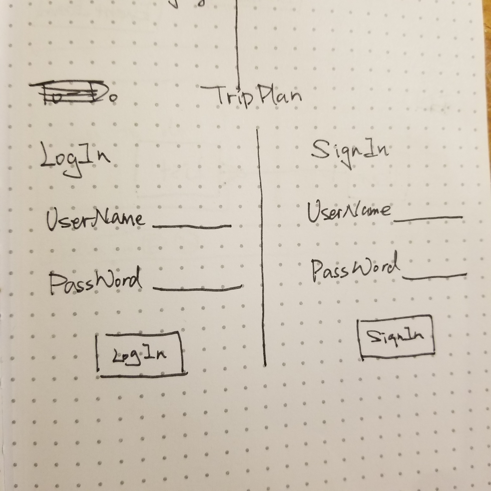
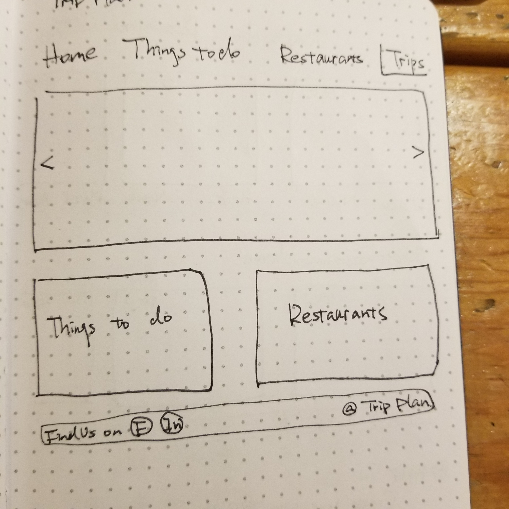
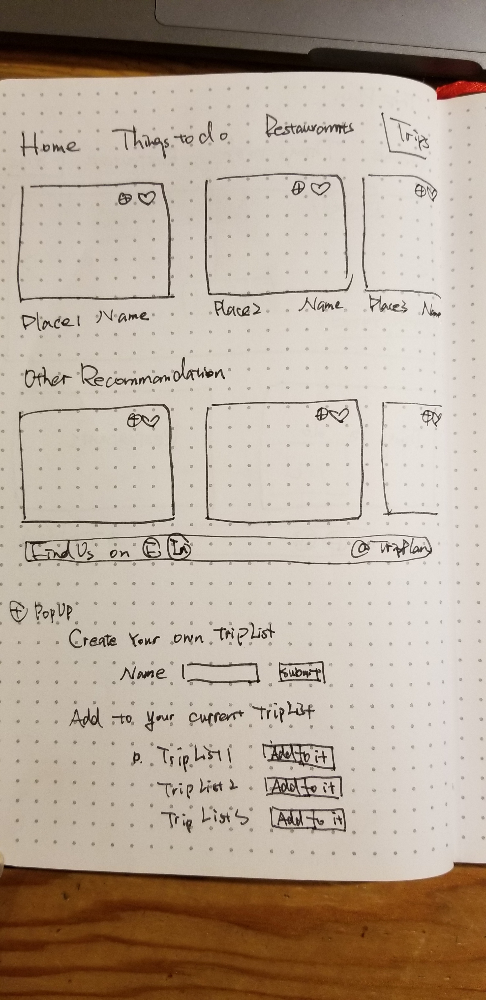
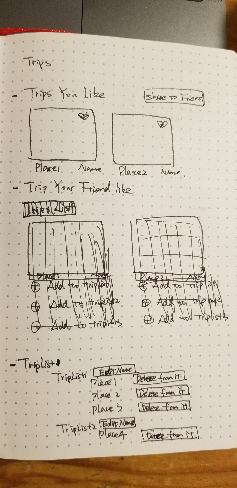
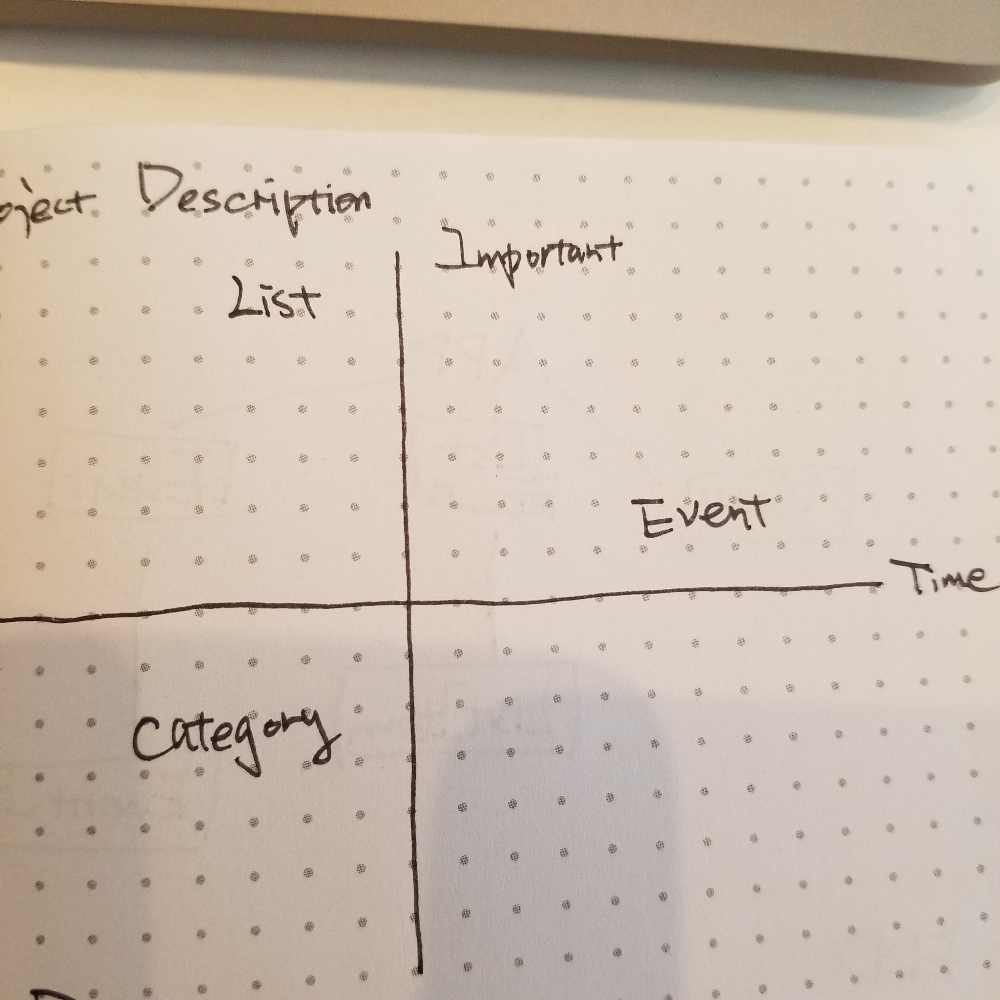
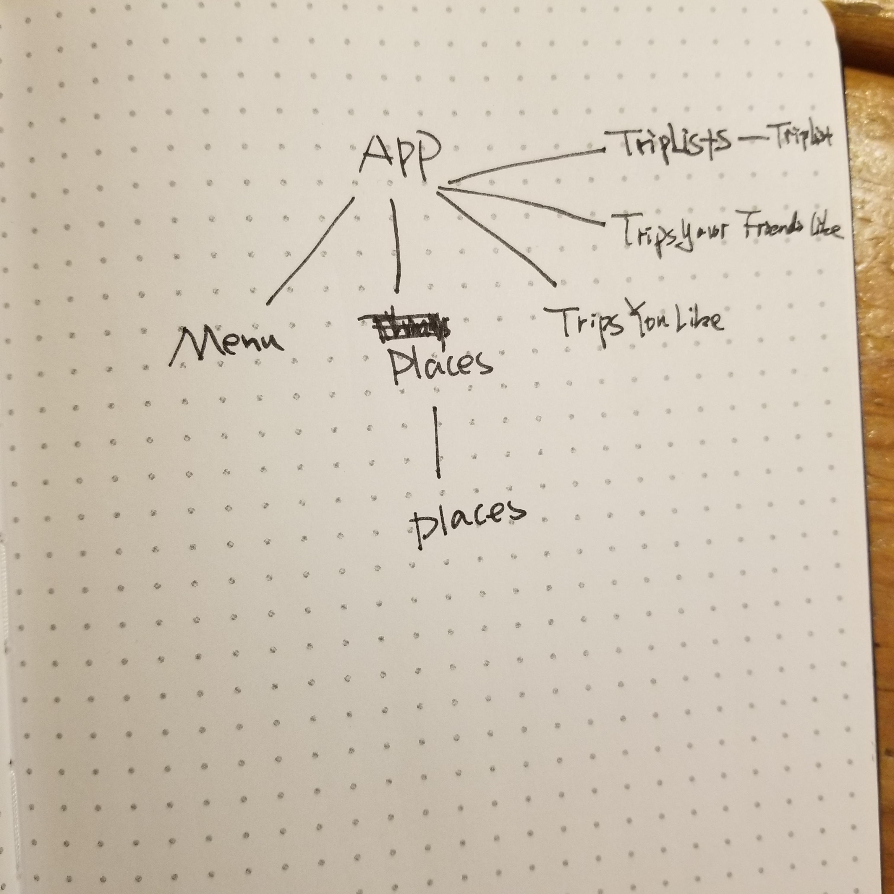
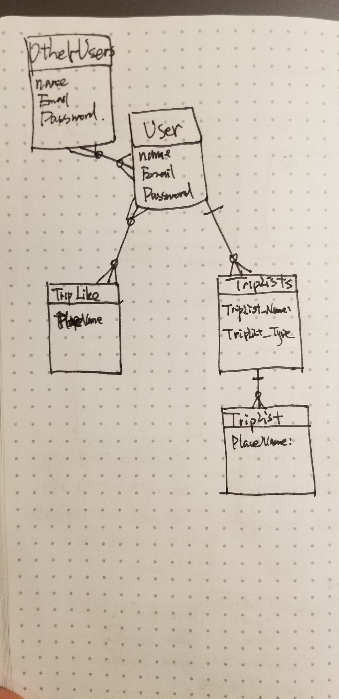

# Trip-Plan

<h2>Project Schedule</h2> 

<h2>Project Description</h2>

This app is to let user create trip plans, user can create trip they like, and share to other users. They can see the trip their friends like. They will have TripList which they create through the popup window or edit in the trip page.

<h2>Wireframes</h2>

<h2>Priority Matrix</h2>

MVP/PostMVP

<h2>Architectural Design</h2>

<h2>ERD</h2>

<h2>MVP (from important to least important)</h2>
<ul>
<li>Build the user interface </li>
<li>Build the database</li>
<li>Display the trip user like and TripList</li>
<li>Display the trip user’s friends like</li>
</ul>

<h2>UI Components</h2> 

<h2>Direction run app</h2>
<ul>
<li>npm i  - both client and backend</li>
<li>bundle install - client</li>
<li>rails db:reset - client</li>
<li>install and uninstall psql - backend </li>
<li>rails s -p 4567 - backend</li>
<li>npm start - client</li>
</ul>

<h2>Additional Libraries</h2>

<h2>Code Snippet</h2>

<h2>Change log</h2>

<h2>Issues and Resolutions</h2>
